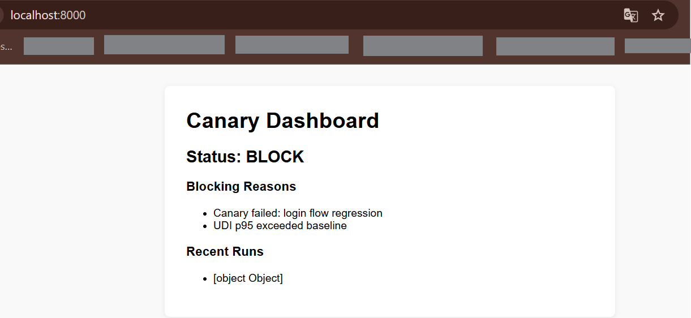

# Guía de uso: Canaries with Teeth

## ¿Qué es esto?

Canaries with Teeth es un sistema que verifica si tu aplicación sigue funcionando correctamente antes de cada despliegue. Lo agregás a tu proyecto y automáticamente empieza a revisar tu código cada vez que hacés un cambio.

## ¿Qué problema resuelve?

Cuando hacés cambios en tu código, a veces rompés cosas sin darte cuenta. Este sistema te avisa **antes** de que esos cambios lleguen a producción, evitando que tus usuarios vean errores.

## ¿En qué proyectos se puede usar?

Funciona en cualquier proyecto que pueda ejecutarse o probarse:

- **Websites y aplicaciones web** (React, Vue, Angular, HTML estático)
- **Frontends** de cualquier tipo
- **APIs y backends** (Node.js, Express, REST, GraphQL)
- **Aplicaciones móviles** con versión web
- **Proyectos chicos** (una página) o **grandes** (múltiples servicios)
- **CI/CD** en GitHub Actions, GitLab CI, Jenkins, etc.

Si tu proyecto puede abrirse en un navegador o responder a peticiones, este sistema puede verificarlo.

## ¿Qué necesita mi proyecto?

Requisitos mínimos:

- Que exista una aplicación que se pueda ejecutar (aunque sea en local)
- Que tenga al menos una página o endpoint que funcione
- Node.js instalado (versión 14 o superior)
- Git para versionar cambios

**No necesitás:**
- Configuración especial
- Credenciales de servicios externos
- Conocimientos avanzados
- Cambiar tu código existente

## ¿Qué hace exactamente?

Cuando lo activás, el sistema:

### Observa:
- Qué páginas o rutas existen en tu aplicación
- Qué funciones nuevas agregaste o eliminaste
- Errores que aparecen al navegar tu aplicación
- Rutas que dejaron de funcionar

### Registra:
- Un mapa de tu aplicación (qué partes tiene)
- Cambios entre la versión anterior y la actual
- Resultados de pruebas automáticas
- Errores encontrados

### Genera:
- Un reporte visual (dashboard) que podés abrir en tu navegador
- Una decisión clara: "permitir el despliegue" o "bloquearlo"
- Archivos con los resultados de cada verificación

## ¿Qué NO hace?

- **No modifica tu código** ni tus archivos existentes
- **No necesita acceso** a bases de datos ni servicios externos
- **No requiere configuración** para funcionar
- **No sube información** a ningún servidor externo
- **No ralentiza** tu flujo de trabajo normal
- **No te obliga** a entender su funcionamiento interno

## Flujo de uso

### 1. Integración inicial

Cuando agregás Canaries with Teeth a tu proyecto:

- Se instala como cualquier otra herramienta
- Crea una prueba básica que navega tu aplicación
- Genera un archivo de configuración mínimo
- Queda listo para usarse

**Qué partes toca:**
- Carpeta `canaries/` (nueva)
- Carpeta `e2e/` (nueva, con las pruebas)
- Tu archivo `package.json` (agrega dependencias)

**Qué cambia en tu proyecto:**
- Nada de tu código existente cambia
- Se agregan archivos nuevos en carpetas propias

**Resultado:**
- Tu proyecto sigue funcionando exactamente igual
- Ahora tenés un sistema de verificación listo para activarse

### 2. Cada vez que hacés un cambio

Cuando hacés commit y push:

- El sistema ejecuta automáticamente la prueba
- Revisa si tu aplicación sigue funcionando
- Compara con la versión anterior
- Te da una respuesta clara: "OK" o "PROBLEMA"

### 3. Dashboard

**Qué muestra:**
- Lista de todas las rutas/páginas de tu aplicación
- Qué cambió desde la versión anterior
- Errores encontrados (si hay)
- Estado de cada verificación (pasó / falló)

**Dónde se genera:**
- En la carpeta `dashboard/` de tu proyecto
- Como archivos HTML estáticos

**Cómo se accede:**
- Abrís el archivo `dashboard/index.html` en tu navegador
- No necesita servidor, funciona directo desde tu computadora

**Para qué sirve:**
- Ver de un vistazo si tu aplicación está bien
- Identificar qué cambió y dónde
- Revisar errores antes de desplegar

**Cómo leerlo:**
- Verde = todo bien
- Rojo = hay un problema
- Lista de cambios = qué agregaste o eliminaste

## ¿Qué cosas NO hay que tocar?

Para que funcione correctamente, **no modifiques:**

- La carpeta `canaries/` (contiene el sistema interno)
- Los archivos en `e2e/` generados automáticamente
- El archivo `playwright.config.js` o `playwright.config.cjs`

**Sí podés:**
- Agregar tus propias pruebas en `e2e/`
- Modificar la prueba básica para que navegue rutas específicas de tu app
- Revisar y abrir los archivos del dashboard cuando quieras

## ¿Cómo sé si está bien integrado?

Checklist simple:

✅ Después de ejecutar `npx canaries init`, ves una carpeta `canaries/` en tu proyecto  
✅ Existe una carpeta `e2e/` con al menos un archivo de prueba  
✅ Al hacer `git push`, se ejecuta automáticamente una verificación  
✅ Se genera un archivo `report.json` con resultados  
✅ Podés abrir `dashboard/index.html` y ves información sobre tu aplicación  
✅ No aparecen errores que interrumpan tu flujo normal de trabajo  

**Si ves todo esto, funciona correctamente.**

## Estado actual del sistema

En este momento, Canaries with Teeth está configurado para:

- **Observar y registrar** todo lo que pasa en tu aplicación
- **Generar reportes** con cada cambio
- **NO bloquear** despliegues automáticamente

Los bloqueos automáticos están apagados. El sistema está listo para activarse cuando lo decidas, pero por ahora solo observa y reporta.

Esto significa que:
- Podés ver qué detecta sin riesgo
- Tus despliegues siguen su flujo normal
- Cuando te sientas cómodo, podés activar los bloqueos automáticos

---

# 30-minute setup

## 1. Install

```sh
npm install --save-dev canaries-with-teeth
```

## 2. Init

```sh
npx canaries init
```

## 3. Push

```sh
git add .
git commit -m "try canaries"
git push
```

---

## What happens next?

- **Every push is gated.**
- **No config required.**
- **No formulas or thresholds exposed.**
- **No thinking needed.**

---

## Example: BLOCKED Release

If a canary fails or risk is too high, your release is blocked.

**Example output:**

```
RELEASE BLOCKED

Reason: Canary failed (login flow regression)
Risk Decision: BLOCK
Artifacts:
  - e2e/canary.e2e.spec.js
  - test-results/
  - report.json
```

---


## Static Dashboard
Generate a static dashboard for every run: (Pure HTML. No backend. Open locally or serve anywhere.)

```sh
npx canaries dashboard
```



---

## Defaults: MODE 0

- Zero configuration
- No contracts or formulas visible
- No tuning
- Works out of the box
- Deterministic decisions only

---

## Architecture & Playbook

For architecture, contracts, and system design:
- docs/architecture/
- docs/contracts/
- playbook/
