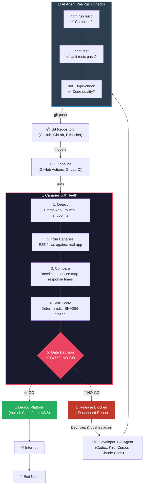

# System Overview

## Where Canaries with Teeth fits

Modern dev workflow with AI coding agents:

```
Developer + AI Agent → pre-push checks → Git → CI → Deploy → Internet → User
```

AI agents (Codex, Kiro, Claude Code) already run builds and tests before pushing. **Canaries with Teeth doesn't compete with that — it covers what AI agents can't.**

---

## What AI agents check vs. what Canaries checks

| Check | AI Agent (pre-push) | Canaries with Teeth (CI) |
|-------|:-------------------:|:------------------------:|
| Code compiles? | **yes** | no |
| Unit tests pass? | **yes** | no |
| Lint / type-check? | **yes** | no |
| Route that existed still exists? | no | **yes** |
| Response time regressed? | no | **yes** |
| New unprotected endpoint appeared? | no | **yes** |
| App behaves like production baseline? | no | **yes** |
| E2E user flows work? | no | **yes** |
| Auditable decision with SHA256? | no | **yes** |
| Deterministic go/no-go gate? | no | **yes** |

**AI agents ask:** "Does this code work?"
**Canaries asks:** "Is this release safe to ship compared to what's running now?"

---

## Full System Diagram



---

## The gap between AI agents and safe deploys

```
AI Agent catches:          Canaries catches:
─────────────────          ──────────────────
❌ Syntax errors            ❌ Route disappeared
❌ Failed unit tests        ❌ Response time 10x slower
❌ Type errors              ❌ New endpoint without auth
❌ Lint violations          ❌ Structural drift from baseline
                           ❌ E2E user flow broken
                           ❌ Risk score above threshold
```

**Code that compiles and passes unit tests can still break production.** That's the gap. A build succeeds, tests pass, the AI agent says "looks good" — but `/checkout` now returns 502, or `/api/payments` went from 50ms to 5 seconds, or a critical route silently disappeared during a refactor.

AI agents work with **the code in isolation**. Canaries works with **the app compared to its previous version**.

---

## What happens at each step

### 1. Detect

`npx canaries init` scans your project:
- Identifies framework (Next.js, Express, static HTML, etc.)
- Discovers all routes and endpoints
- Generates Playwright canaries automatically
- Establishes performance baselines

**You never write a test.**

### 2. Run Canaries

On every push, auto-generated E2E tests:
- Navigate every discovered route
- Check status codes (200, 404, 500, etc.)
- Measure response times
- Execute real user flows

### 3. Compare

Every result is compared against the **previous baseline**:
- Did a route disappear?
- Did response time regress significantly?
- Did the service map structure change?
- Are there new unprotected endpoints?

### 4. Risk Score

All signals aggregate into a deterministic score (0-100). The formula is **SHA256-hashed and version-controlled**. Same inputs = same result, forever.

### 5. Gate Decision

| Condition | Decision |
|-----------|----------|
| All canaries pass + risk below threshold | **GO** — deploy proceeds |
| Any canary fails OR risk above threshold | **NO-GO** — release blocked |

No warnings. No "maybe." **GO or NO-GO.**

---

## Simplified flow

```
Developer + AI Agent
    ↓
  [build, test, lint] ← AI agent handles this
    ↓
  git push
    ↓
  CI Pipeline
    ↓
  🦷 Canaries with Teeth ← compares against production baseline
    ↓
  ✅ GO → Deploy → Internet → User
  🚫 NO-GO → Blocked (fix & push again)
```

---

## What Canaries with Teeth does NOT touch

- Your source code (read-only analysis)
- Your AI agent's workflow (additive layer, not replacement)
- Your deploy platform (only controls the gate)
- Your existing tests (additive, not replacement)
- External services (fully local, no SaaS)
